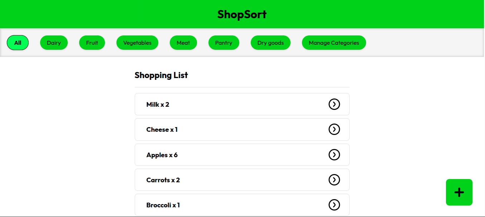
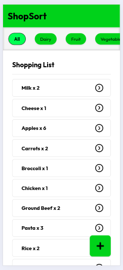

# TOP Inventory App - ShopSort

## Summary

A smart shopping list application that helps you organize items by categories. Based on an app I used daily before it was taken down: [HNGRY](https://iamhngry.com/en/).

## Preview

| Desktop                                 | Mobile                                |
| --------------------------------------- | ------------------------------------- |
|  |  |

## Project Highlights

- Database integration for CRUD operations on items and categories
- Proper error handling with custom error middleware
- Deployment using Koyeb hosting platform
- Custom favicon implementation using `serve-favicon`
- Admin authentication middleware for Update and Delete operations
- Category data middleware for seamless data flow

## Challenges Overcome

- Successfully deploying to Koyeb with SSL configuration
- Implementing secure admin password prompts
- Creating a responsive horizontal scrollable navigation bar for categories
- Adding custom favicon to the application
- Developing middleware to handle admin authentication before POST requests
- Implementing dynamic active classes using EJS conditionals to highlight current category

## New Skills Acquired

- Password validation middleware using hidden input fields
- Proper MVC (Model-View-Controller) architecture setup
- Koyeb deployment with database URI and SSL configuration
- Comprehensive error handling with custom error middleware
- Modular route handling using array syntax for multiple middleware functions
- Form validation using `express-validator` for input sanitization and validation

## Technologies Used

- **Frontend:** HTML, CSS, JavaScript, EJS templating
- **Backend:** Node.js, Express.js
- **Database:** PostgreSQL with PG driver
- **Validation:** express-validator
- **Utilities:** serve-favicon, dotenv
- **Deployment:** Koyeb

## Installation & Setup

To clone and run this project locally:

1. **Clone the repository:**

   ```bash
   git clone https://github.com/SReddy-96/TOP-inventory-app.git
   ```

2. **Navigate to project directory:**

   ```bash
   cd TOP-inventory-app
   ```

3. **Install dependencies:**

    ```bash
    npm install
    ```

4. **Set up environment variables:**
   - Create a `.env` file in the root directory
   - Add your database connection string and other required variables

5. **Start the server:**

   ```bash
   node app.js
   ```

6. **Access the application:**
   - Open your browser and navigate to `http://localhost:3000` (or the port specified in your .env file)
